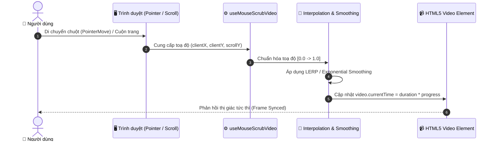

<div align="center">

  # ⚡ YOUNGFOLIO
  ### *Cinematic Mouse-Scrub Portfolio & 3D Interactive Web Experience*

  [](https://git.io/typing-svg)

  <p align="center">
    <a href="https://ltcuong24.io.vn">
      
    </a>
    <a href="https://github.com/ekancisme/youngfolio/stargazers">
      
    </a>
    <a href="https://github.com/ekancisme/youngfolio/blob/main/LICENSE">
      
    </a>
  </p>

  <p align="center">
    
    
    
    
    
    
  </p>

  ---

  <p align="center">
    <a href="#-nổi-bật--key-highlights">🌟 Tính năng nổi bật</a> •
    <a href="#-kiến-trúc-mouse-scrubbing">🎬 Cơ chế Scrub Video</a> •
    <a href="#-công-nghệ-sử-dụng">🛠 Công nghệ</a> •
    <a href="#-cài-đặt--chạy-dự-án">🚀 Cài đặt</a> •
    <a href="#-triển-khai-production">🐳 Docker & Deploy</a> •
    <a href="#-kết-nối">📬 Liên hệ</a>
  </p>

</div>

<br/>

## 🌟 Nổi bật / Key Highlights

<table>
  <tr>
    <td width="50%">
      <h3>🎬 Cinematic Mouse-Scrub Hero</h3>
      <p>Trải nghiệm Hero video tua mượt mà dựa trên toạ độ con trỏ chuột và độ sâu cuộn trang (Scroll & Cursor Sync), tạo cảm giác 3D không gian chiều sâu chân thực.</p>
    </td>
    <td width="50%">
      <h3>🌐 Đa ngôn ngữ (Tiếng Việt / English)</h3>
      <p>Hệ thống dịch thuật ngữ cảnh <code>LanguageProvider</code> linh hoạt, chuyển đổi ngôn ngữ tức thời không giật lag, lưu cache và đồng bộ toàn trang.</p>
    </td>
  </tr>
  <tr>
    <td width="50%">
      <h3>⚡ Hiệu ứng Typewriter & Scroll Reveal</h3>
      <p>Chữ gõ tự động sinh động với con trỏ nhấp nháy, các section tự động hiển thị mượt mà với kỹ thuật tối ưu GPU compositing.</p>
    </td>
    <td width="50%">
      <h3>♿ Accessibility First (a11y)</h3>
      <p>Hỗ trợ đầy đủ tiêu chuẩn <code>prefers-reduced-motion</code>: tự động chuyển sang trải nghiệm tĩnh tinh tế cho người dùng nhạy cảm với chuyển động.</p>
    </td>
  </tr>
  <tr>
    <td width="50%">
      <h3>📱 Thiết kế Responsive & Glassmorphism</h3>
      <p>Giao diện siêu hiện đại với tông tối (Dark Futuristic Theme), thanh điều hướng mờ kính (Backdrop Blur), Drawer Menu tối ưu cho thiết bị di động.</p>
    </td>
    <td width="50%">
      <h3>🚀 Tối ưu hoá tài nguyên tối đa</h3>
      <p>Tích hợp sẵn script nén & tối ưu Video keyframe (PowerShell tool), định dạng ảnh WebP nén nhẹ, font Manrope Variable tải siêu nhanh.</p>
    </td>
  </tr>
</table>

---

## 🎬 Kiến trúc Mouse-Scrubbing

Cơ chế điều khiển video tua từng khung hình (Frame-by-Frame Scrubbing) theo chuyển động chuột và quán tính cuộn:



<details>
<summary><b>🔍 Xem chi tiết giải thuật tối ưu video tua mượt</b></summary>

- **Keyframe Density**: Video hero được mã hóa đặc biệt với tần suất I-frame (Keyframe) dày đặc qua script [`tools/encode-hero.ps1`](file:///home/youngltc/Documents/Coding/3D/tools/encode-hero.ps1), giúp trình duyệt giải mã khung hình tức thì mà không bị trễ hay giật lag.
- **RequestAnimationFrame**: Toàn bộ thao tác cập nhật `currentTime` được đưa vào `requestAnimationFrame` loop nhằm tránh nghẽn luồng chính và đảm bảo 60fps/120fps.
- **Reduced Motion Fallback**: Khi phát hiện cấu hình hệ thống bật `prefers-reduced-motion`, hook sẽ tự động dừng tua chuột và giữ video ở trạng thái background tĩnh tối ưu.
</details>

---

## 🛠 Công nghệ sử dụng

| Phân loại | Công nghệ | Phiên bản | Vai trò |
| :--- | :--- | :--- | :--- |
| **Frontend Core** | [React](https://react.dev/) | `^19.3.0` | Thư viện UI hiện đại nhất với kiến trúc render tối ưu |
| **Ngôn ngữ** | [TypeScript](https://www.typescriptlang.org/) | `^6.0.3` | Đảm bảo type-safe toàn bộ hook, component và i18n dictionary |
| **Build Tool** | [Vite](https://vitejs.dev/) | `^8.2.2` | Hot Module Replacement (HMR) cực nhanh, đóng gói siêu nhẹ |
| **Styling** | [Tailwind CSS](https://tailwindcss.com/) | `^4.3.3` | Utility-first CSS Engine v4 mới nhất kết hợp `@tailwindcss/vite` |
| **Typography** | [Manrope](https://fontsource.org/fonts/manrope) | `^5.3.0` | Font chữ biến thiên (Variable Font) hiện đại, sắc nét |
| **Triển khai** | [Docker](https://www.docker.com/) & [Nginx](https://nginx.org/) | Multi-stage | Alpine-based container, bảo mật cao, tải tĩnh cực nhanh |

---

## 📂 Cấu trúc thư mục

```ascii
youngfolio/
├── 📁 public/                  # Tài nguyên tĩnh
│   ├── 🎥 hero-scrub.mp4       # Video hero đã tối ưu cho mouse scrub
│   ├── 📁 projects/            # Ảnh mockup các dự án (WebP/PNG)
│   ├── 📄 Le-The-Cuong-CV.pdf   # File CV cá nhân tải xuống
│   └── 🎨 favicon.svg          # Favicon vector
├── 📁 src/
│   ├── 📁 components/          # Các component giao diện
│   │   ├── 🎬 Hero.tsx         # Hero section chính
│   │   ├── 📹 MouseScrubVideo  # Component canvas/video tua chuột
│   │   ├── 🧭 Navbar.tsx       # Thanh điều hướng Glassmorphism
│   │   ├── 📱 MobileMenu.tsx   # Menu Drawer di động
│   │   ├── ⌨️ TypewriterText   # Hiệu ứng chữ gõ tự động
│   │   ├── 💊 ActionPills.tsx  # Cụm nút CTA thao tác nhanh
│   │   ├── 💼 PortfolioSections# Giới thiệu, Kỹ năng, Liên hệ
│   │   └── 🎴 ProjectCard.tsx  # Thẻ hiển thị dự án tiêu biểu
│   ├── 📁 hooks/               # Custom React Hooks
│   │   ├── 🖱️ useMouseScrubVideo.ts
│   │   ├── 📜 useHeroScrollMotion.ts
│   │   ├── 👁️ useScrollReveal.ts
│   │   └── ⌨️ useTypewriter.ts
│   ├── 📁 i18n/                # Hệ thống đa ngôn ngữ (VI / EN)
│   │   ├── 🗣️ LanguageProvider.tsx
│   │   └── 📖 translations.ts
│   ├── 🎨 index.css            # Custom CSS animations & Tailwind v4
│   └── 🚀 main.tsx             # Điểm khởi chạy React App
├── 📁 tools/                   # Công cụ hỗ trợ
│   └── 🎞️ encode-hero.ps1      # Script nén video keyframe
├── 🐳 Dockerfile               # Docker build 2-stage (Node -> Nginx)
├── ⚙️ nginx.conf.template      # Cấu hình Web Server Nginx
├── 🚢 deploy.ps1               # Script deploy tự động lên máy chủ VPS
└── 📦 package.json             # Danh sách thư viện & scripts
```

---

## 🚀 Cài đặt & Chạy dự án

### Yêu cầu môi trường
- **Node.js**: `v20.x` trở lên
- **npm** hoặc **pnpm / yarn**

### Các bước khởi chạy

```bash
# 1. Clone repository
git clone https://github.com/ekancisme/youngfolio.git
cd youngfolio

# 2. Cài đặt các gói phụ thuộc
npm install

# 3. Khởi chạy môi trường phát triển (Dev Server)
npm run dev
```

Truy cập ngay tại: **`http://localhost:5173`** 🚀

### Kiểm tra & Đóng gói sản phẩm

```bash
# Kiểm tra định dạng code (Linting)
npm run lint

# Build bản sản phẩm (Production Build)
npm run build

# Xem thử bản Build nội bộ
npm run preview
```

---

## 🐳 Triển khai Production

Dự án đã được container hóa hoàn chỉnh bằng **Docker Multi-Stage Build** kết hợp **Nginx Alpine**:

### Chạy bằng Docker cục bộ

```bash
# Build Docker Image
docker build -t youngfolio:latest .

# Khởi chạy container trên cổng 5001
docker run -d -p 5001:5001 --name youngfolio-app youngfolio:latest
```

Truy cập kiểm tra tại: `http://localhost:5001`

### Tự động deploy lên VPS (Bash hoặc PowerShell)

Dự án cung cấp sẵn cả script Bash ([`deploy.sh`](file:///home/youngltc/Documents/Coding/3D/deploy.sh)) cho Linux và PowerShell ([`deploy.ps1`](file:///home/youngltc/Documents/Coding/3D/deploy.ps1)) cho Windows:

**Trên Linux / macOS:**
```bash
./deploy.sh "youngfolio" "ltcuong24.io.vn" 5001 "deploy.env"
```

**Trên Windows (PowerShell):**
```powershell
./deploy.ps1 -AppName "youngfolio" -Domain "ltcuong24.io.vn" -ContainerPort 5001 -EnvFile "deploy.env"
```

---

## 📬 Kết nối & Tác giả

<div align="center">

  **Lê Thế Cường (youngltc)**  
  *Frontend / Fullstack Developer*

  <p>
    <a href="https://ltcuong24.io.vn">
      
    </a>
    <a href="https://github.com/ekancisme">
      
    </a>
    <a href="mailto:lethecuong2k4@gmail.com">
      
    </a>
  </p>

  ⭐ Nếu bạn thấy dự án này thú vị, đừng quên để lại một ngôi sao trên [GitHub Repository](https://github.com/ekancisme/youngfolio) nhé!

</div>
